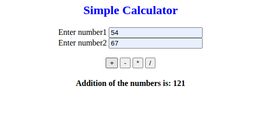
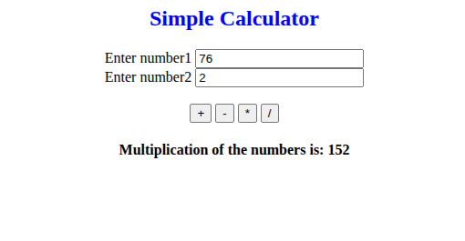
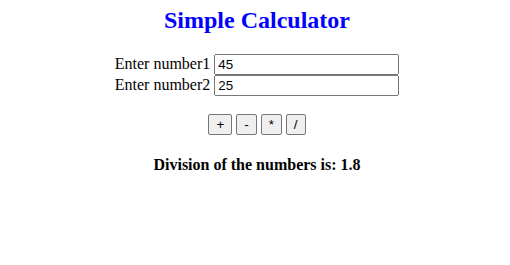
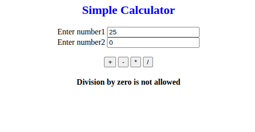

# Simple Calculator

A basic web-based calculator built with HTML and JavaScript.  
This calculator allows the user to perform **addition, subtraction, multiplication, and division** with input validation.

---

## 📝 Features

- Perform addition, subtraction, multiplication, and division.
- Input validation: only numbers allowed.
- Prevents division by zero.
- Displays results dynamically on the page.
- Screenshots of each operation are included in the `outputs` folder.

---

## 📂 Project Structure
Simple_Calculator/
│
├─ simple_Calculator.html      # Main HTML file
├─ outputs/                    # Screenshots of calculator results
│   ├─ addition.png
│   ├─ subtraction.png
│   ├─ multiplication.png
│   ├─ division.png
│   └─ divisionByZero.png

---

## ⚡ How to Use

1. Open `simple_Calculator.html` in a web browser.
2. Enter two numbers in the input fields.
3. Click one of the operator buttons (`+`, `-`, `*`, `/`).
4. View the result below the buttons.

---

## 💻 Example Operations

### 1. Addition

- Input: `54` and `67` → Click `+`  
- Output: `Addition of the numbers is: 121`  

---

### 2. Subtraction

- Input: `46` and `30` → Click `-`  
- Output: `Subtraction of the numbers is: 16`  

---

### 3. Multiplication

- Input: `76` and `2` → Click `*`  
- Output: `Multiplication of the numbers is: 152`  

---

### 4. Division

- Input: `45` and `25` → Click `/`  
- Output: `Division of the numbers is: 1.8`  

---

### 5. Division by Zero

- Input: `25` and `0` → Click `/`  
- Output: `Division by zero is not allowed`  

---

## 🛠️ Implementation Details

- **`validation(operator)`**: Checks if inputs are numbers; calls `calculate(operator)` if valid.  
- **`calculate(operator)`**: Performs the operation and updates the `<h4>` element with `id="result_id"`. Handles division by zero gracefully.  

---

## 🎨 Notes

- Works on all modern browsers.
- No external libraries required.
- Great for learning basic JavaScript DOM manipulation and form validation.
